# Game_Radionova

## Диаграмма классов

------------------------------------------------------------

## Описание классов

------------------------------------------------------------

### Класс: StartForm
Назначение: начальная форма запуска игры \
Зависимости: GameSettings, GameForm \
Методы:
- StartForm() – конструктор формы
- button1_Click(...) – запуск игры, передача настроек в GameForm

------------------------------------------------------------

### Класс: GameForm
Назначение: основной UI, отображение интерфейса игры \
Зависимости: GameSettings, Game, GameController, Player, TileView, CountdownTimer, BackgroundMusicPlayer \
Методы:
- GameForm(settings) – конструктор с настройками
- InitUI() – создание визуальных элементов
- StartGame() – запуск игрового процесса
- OnTileClicked(tile) – обработка кликов
- ShowGameResult(...) – вывод результата игры

------------------------------------------------------------

### Класс: GameController
Назначение: связывает логику (Game) и UI (GameForm) \
Зависимости: Game, Player, Card \
Методы:
- GameController(game)
- SelectCard(card) – передаёт выбор карточки в Game
- ResetTurn() – сброс выбранных карточек
- События: OnMatchChecked, OnTurnChanged, OnGameFinished

------------------------------------------------------------

### Класс: Game
Назначение: игровая логика (состояния, игроки, правила) \
Зависимости: Card, Player \
Методы:
- Cards – список карточек
- Players – список игроков
- CurrentPlayer – активный игрок
- SelectCard() – логика выбора
- CheckMatch() – проверка совпадения
- NextTurn() – передача хода
- ResetTurn() – сброс выбора
- IsGameFinished() – конец игры

------------------------------------------------------------

### Класс: GameEngine
Назначение: генерация карточек и параметров поля \
Зависимости: GameSettings, Card \
Методы:
- GameEngine(settings)
- GenerateCards()
- GetGridSize(...)
- Rows / Columns

------------------------------------------------------------

### Класс: GameSettings
Назначение: хранение параметров игры \
Свойства: 
- Difficulty – уровень сложности
- IsMultiplayer – одиночный или многопользовательский режим

------------------------------------------------------------

### Класс: Player
Назначение: игрок, очки, имя \
Методы:
- Name – имя игрока
- Score – очки
- AddPoint() – +1 очко
- ResetScore() – обнуление

------------------------------------------------------------

### Класс: Card
Назначение: логическая карточка игры \
Методы:
- ImagePath – путь к изображению
- IsFlipped / IsMatched – состояние карточки
- Flip() – перевернуть
- Match() – пометить совпадшей
- Reset() – сброс

------------------------------------------------------------

### Класс: TileView
Назначение: визуальный элемент карточки (UI) \
Зависимости: Card, PictureBox
Методы:
- Card – логическая карточка
- Picture – UI элемент
- Update() – обновить визуально
- Hide() – скрыть
- ShowMatch() – показать
- Flip() – перевернуть

------------------------------------------------------------

### Класс: CountdownTimer
Назначение: управление таймером в одиночной игре \
Методы:
- CountdownTimer(maxTime)
- Start() / Stop()
- TimeUpdated / TimeEnded – события

------------------------------------------------------------

### Класс: BackgroundMusicPlayer
Назначение: воспроизведение фоновой музыки \
Методы:
- Play(filename)
- Stop()

------------------------------------------------------------

### Класс: GameBoardRenderer
Назначение: отрисовка поля игры \
Зависимости: TileView, Game \
Методы:
- Render(...)

------------------------------------------------------------

### Класс: GameResultDisplayer
Назначение: окно с финальным результатом \
Зависимости: Game, Player \
Методы:
- Show(...)
